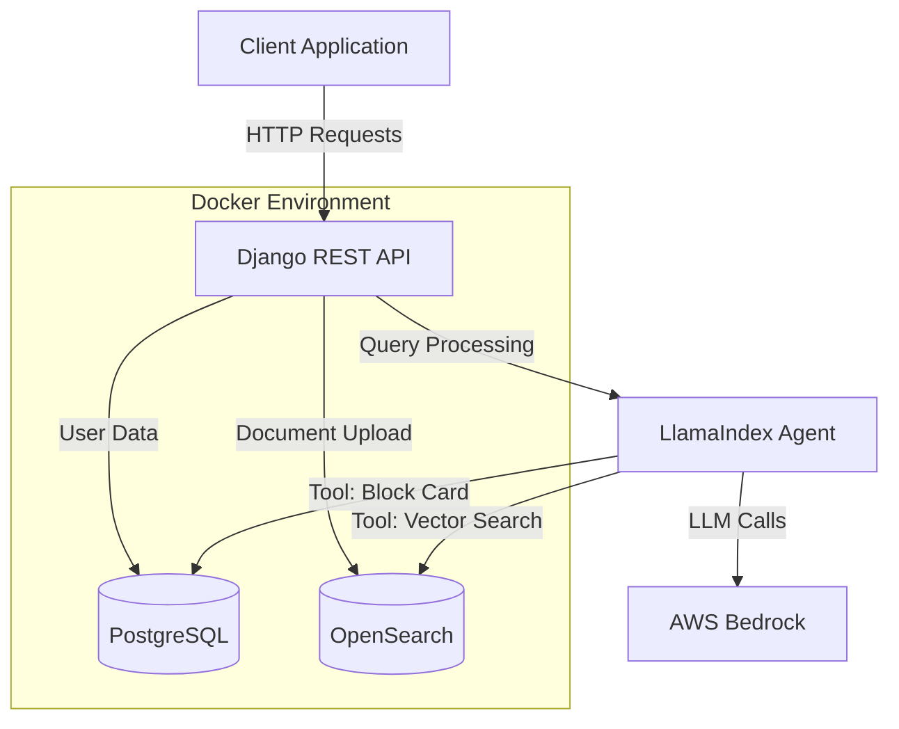
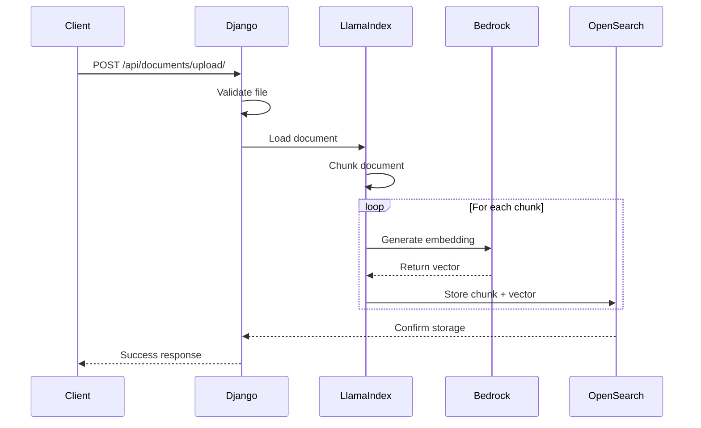
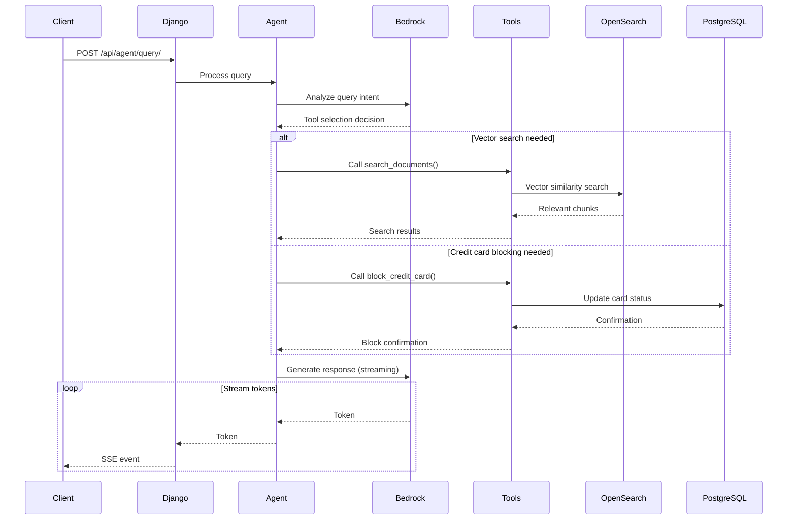

# Design Document

## Overview

Fintalk is a Django REST API that implements a RAG-based AI agent for financial document querying and credit card management. The system architecture consists of three main containerized services: Django application server, PostgreSQL database, and OpenSearch vector store. The application uses LlamaIndex as the agent framework with AWS Bedrock providing LLM and embedding capabilities.

The agent operates with two specialized tools that it can dynamically select based on user queries: a vector retriever for semantic document search and a credit card blocking function for account management. All responses from the agent are streamed in real-time to provide a responsive user experience.

## Architecture

### System Components



### Container Architecture

- **Django Container**: Runs the Django application with uvicorn ASGI server, exposes port 8000
- **PostgreSQL Container**: Stores user data with persistent volume mounted at `/var/lib/postgresql/data`
- **OpenSearch Container**: Stores vector embeddings with persistent volume mounted at `/usr/share/opensearch/data`
- **Docker Network**: All containers communicate via a shared bridge network named `fintalk-network`

### Technology Stack

- **Framework**: Django 4.2+ with Django REST Framework
- **Agent Framework**: LlamaIndex 0.9+
- **Vector Store**: OpenSearch 2.11+
- **Database**: PostgreSQL 15+
- **AI Service**: AWS Bedrock (amazon.nova-lite-v1:0 for LLM, amazon.titan-embed-text-v2:0 for vectors embeddings)
- **Containerization**: Docker & Docker Compose
- **Python**: 3.11+

## Components and Interfaces

### 1. Django Application Structure

```
fintalk/
├── manage.py
├── config/
│   ├── settings.py
│   ├── urls.py
│   ├── asgi.py
│   └── wsgi.py
├── api/
│   ├── models.py          # User model
│   ├── views.py           # API endpoints
│   ├── serializers.py     # DRF serializers
│   ├── urls.py            # API routes
│   └── tests.py           # Test suite
├── agent/
│   ├── agent.py           # LlamaIndex agent setup
│   ├── tools.py           # Custom agent tools
│   ├── vector_store.py    # OpenSearch integration
│   └── bedrock_client.py  # AWS Bedrock configuration
├── requirements.txt
├── Dockerfile
└── docker-compose.yml
```

### 2. Data Models

#### User Model (PostgreSQL)

```python
class User(models.Model):
    username = models.CharField(max_length=100, unique=True)
    phone_number = models.CharField(max_length=20, unique=True)
    credit_card_number = models.CharField(max_length=19)
    card_status = models.CharField(
        max_length=10,
        choices=[('active', 'Active'), ('blocked', 'Blocked')],
        default='active'
    )
    created_at = models.DateTimeField(auto_now_add=True)
    updated_at = models.DateTimeField(auto_now=True)
```

#### Document Storage (OpenSearch)

Documents are stored as vector embeddings in OpenSearch. The index is automatically created by OpensearchVectorClient with the following configuration:

- **Dimension**: 1024 (for amazon.titan-embed-text-v2:0)
- **Algorithm**: HNSW with FAISS engine
- **Space Type**: L2 distance
- **Parameters**: ef_construction=256, m=48
- **Fields**:
  - `embedding`: knn_vector field for semantic search
  - `content`: text field for document content
  - `metadata`: object field containing filename, upload_date, chunk_index, and total_chunks

### 3. API Endpoints

#### POST /api/documents/upload/

Uploads a document and stores it in the vector database.

**Request:**
```
Content-Type: multipart/form-data
file: <document file>
```

**Response:**
```json
{
  "status": "success",
  "document_id": "uuid",
  "chunks_created": 15,
  "message": "Document uploaded and indexed successfully"
}
```

#### POST /api/agent/query/

Sends a query to the RAG agent with streaming response.

**Request:**
```json
{
  "message": "What are the key points in the financial report?",
  "phone_number": "+1234567890"  // Optional, used for credit card operations
}
```

**Response:**
```
Content-Type: text/event-stream

data: {"type": "token", "content": "Based"}
data: {"type": "token", "content": " on"}
data: {"type": "token", "content": " the"}
...
data: {"type": "done"}
```

### 4. LlamaIndex Agent Configuration

#### Agent Setup

The agent is configured as a ReActAgent with the following components:

- **LLM**: AWS Bedrock Claude 3 Sonnet with streaming enabled
- **Tools**: Vector retriever and credit card blocker
- **Memory**: Conversation buffer to maintain context
- **Max Iterations**: 10 to prevent infinite loops

#### Tool Definitions

**Vector Retriever Tool:**
```python
@tool
def search_documents(query: str) -> str:
    """
    Searches through uploaded documents using semantic similarity.
    
    Args:
        query: The search query to find relevant document chunks
        
    Returns:
        Relevant document excerpts that match the query
    """
    # Implementation uses OpenSearch vector similarity search
```

**Credit Card Blocking Tool:**
```python
@tool
def block_credit_card(phone_number: str) -> str:
    """
    Blocks a credit card associated with the given phone number.
    
    Args:
        phone_number: The phone number associated with the account
        
    Returns:
        Confirmation message with the blocked card details
    """
    # Implementation updates PostgreSQL User model
```

### 5. AWS Bedrock Integration

#### Configuration

```python
from llama_index.llms.bedrock_converse import BedrockConverse
from llama_index.embeddings.bedrock import BedrockEmbedding

# LlamaIndex Bedrock LLM using BedrockConverse (recommended)
llm = BedrockConverse(
    model="amazon.nova-lite-v1:0",
    aws_access_key_id=os.getenv('AWS_ACCESS_KEY_ID'),
    aws_secret_access_key=os.getenv('AWS_SECRET_ACCESS_KEY'),
    aws_session_token=os.getenv('AWS_SESSION_TOKEN'),
    region_name=os.getenv('AWS_REGION', 'us-east-1'),
    temperature=0.7,
    max_tokens=2048
)

# LlamaIndex Bedrock Embeddings
embed_model = BedrockEmbedding(
    model_name="amazon.titan-embed-text-v2:0",
    aws_access_key_id=os.getenv('AWS_ACCESS_KEY_ID'),
    aws_secret_access_key=os.getenv('AWS_SECRET_ACCESS_KEY'),
    aws_session_token=os.getenv('AWS_SESSION_TOKEN'),
    region_name=os.getenv('AWS_REGION', 'us-east-1'),
    context_size=8192
)
```

### 6. Vector Store Integration

#### OpenSearch Setup

```python
from llama_index.vector_stores.opensearch import (
    OpensearchVectorStore,
    OpensearchVectorClient
)
from llama_index.core import StorageContext

# Initialize OpenSearch vector client
client = OpensearchVectorClient(
    endpoint=os.getenv('OPENSEARCH_ENDPOINT', 'http://opensearch:9200'),
    index=os.getenv('OPENSEARCH_INDEX', 'fintalk_documents'),
    dim=1024,  # Dimension for amazon.titan-embed-text-v2:0
    embedding_field="embedding",
    text_field="content",
    method={
        "name": "hnsw",
        "engine": "faiss",
        "space_type": "l2",
        "parameters": {
            "ef_construction": 256,
            "m": 48
        }
    },
    http_auth=(
        os.getenv('OPENSEARCH_USER', 'admin'),
        os.getenv('OPENSEARCH_PASSWORD')
    ),
    use_ssl=os.getenv('OPENSEARCH_USE_SSL', 'true').lower() == 'true',
    verify_certs=False
)

# Create vector store
vector_store = OpensearchVectorStore(client)

# Create storage context
storage_context = StorageContext.from_defaults(vector_store=vector_store)
```

## Data Flow

### Document Upload Flow



### Agent Query Flow



## Error Handling

### Error Categories and Responses

1. **Validation Errors (400)**
   - Missing required fields
   - Invalid file format
   - Malformed request body

2. **Authentication Errors (401)**
   - Invalid AWS credentials
   - Expired tokens

3. **Not Found Errors (404)**
   - User not found by phone number
   - Document not found

4. **Service Unavailable (503)**
   - OpenSearch connection failure
   - PostgreSQL connection failure
   - AWS Bedrock API unavailable

5. **Internal Server Errors (500)**
   - Unexpected exceptions
   - Agent execution failures

### Error Response Format

```json
{
  "error": {
    "code": "SERVICE_UNAVAILABLE",
    "message": "Unable to connect to vector store",
    "details": "Connection timeout after 30 seconds"
  }
}
```

### Retry Logic

- AWS Bedrock calls: 3 retries with exponential backoff
- OpenSearch operations: 2 retries with 1-second delay
- PostgreSQL operations: Django's built-in connection pooling handles retries

## Testing Strategy

### Unit Tests

1. **Model Tests** (`api/tests/test_models.py`)
   - User model creation and validation
   - Card status transitions
   - Phone number formatting

2. **Tool Tests** (`agent/tests/test_tools.py`)
   - Vector retriever with mocked OpenSearch
   - Credit card blocker with test database
   - Tool parameter validation

3. **Serializer Tests** (`api/tests/test_serializers.py`)
   - Request validation
   - Response formatting

### Integration Tests

1. **API Endpoint Tests** (`api/tests/test_views.py`)
   - Document upload with sample files
   - Agent query with mocked Bedrock responses
   - Streaming response validation
   - Error handling scenarios

2. **Agent Tests** (`agent/tests/test_agent.py`)
   - End-to-end agent execution with mocked LLM
   - Tool selection logic
   - Multi-turn conversations

3. **Database Tests** (`api/tests/test_database.py`)
   - User CRUD operations
   - Transaction handling
   - Concurrent access scenarios

### Test Data

- **Dummy Users**: 10 users with varied phone number formats and card statuses
- **Sample Documents**: PDF and TXT files with financial content
- **Mock Responses**: Pre-recorded AWS Bedrock responses for consistent testing

### Test Execution

```bash
# Run all tests
python manage.py test

# Run with coverage
coverage run --source='.' manage.py test
coverage report

# Run specific test module
python manage.py test api.tests.test_views
```

## Configuration Management

### Environment Variables

```bash
# Django
SECRET_KEY=<django-secret-key>
DEBUG=False
ALLOWED_HOSTS=localhost,127.0.0.1

# Database
POSTGRES_DB=fintalk
POSTGRES_USER=fintalk_user
POSTGRES_PASSWORD=fintalk_password
POSTGRES_HOST=postgres
POSTGRES_PORT=5432

# OpenSearch
OPENSEARCH_ENDPOINT=http://opensearch:9200
OPENSEARCH_USER=admin
OPENSEARCH_PASSWORD=Rag-test-bs23@123

# AWS Bedrock
AWS_REGION=us-east-1
AWS_REGION=us-east-1
AWS_ACCESS_KEY_ID=your-aws-access-key-id
AWS_SECRET_ACCESS_KEY=your-aws-secret-access-key
AWS_SESSION_TOKEN=your-aws-session-token-if-using-temporary-credentials
BEDROCK_LLM_MODEL=amazon.nova-lite-v1:0
BEDROCK_EMBEDDING_MODEL=amazon.titan-embed-text-v2:0

```

### Docker Compose Configuration

```yaml
version: '3.8'

name: fintalk

services:
  postgres:
    image: postgres:15
    container_name: fintalk-postgres
    environment:
      POSTGRES_DB: ${POSTGRES_DB}
      POSTGRES_USER: ${POSTGRES_USER}
      POSTGRES_PASSWORD: ${POSTGRES_PASSWORD}
    volumes:
      - postgres_data:/var/lib/postgresql/data
    networks:
      - fintalk-network

  opensearch:
    image: opensearchproject/opensearch:2.11.0
    container_name: fintalk-opensearch
    environment:
      - discovery.type=single-node
      - OPENSEARCH_INITIAL_ADMIN_PASSWORD=${OPENSEARCH_PASSWORD}
    volumes:
      - opensearch_data:/usr/share/opensearch/data
    networks:
      - fintalk-network

  django:
    build: .
    container_name: fintalk-django
    command: uvicorn config.asgi:application --host 0.0.0.0 --port 8000 --reload
    ports:
      - "8000:8000"
    env_file:
      - .env
    depends_on:
      - postgres
      - opensearch
    networks:
      - fintalk-network
    volumes:
      - .:/app

volumes:
  postgres_data:
  opensearch_data:

networks:
  fintalk-network:
    driver: bridge
```

## Security Considerations

1. **Sensitive Data Protection**
   - Credit card numbers stored with encryption at rest (PostgreSQL encryption)
   - Environment variables for all credentials
   - No hardcoded secrets in code

2. **API Security**
   - CORS configuration for allowed origins
   - Rate limiting on endpoints
   - Input validation and sanitization

3. **AWS Security**
   - IAM roles with minimal required permissions
   - Bedrock access limited to specific models
   - Credentials rotation policy

4. **Container Security**
   - Non-root user in Docker containers
   - Minimal base images
   - Regular security updates

## Performance Considerations

1. **Vector Search Optimization**
   - HNSW algorithm for fast approximate nearest neighbor search
   - Index warming on startup
   - Batch embedding generation for large documents

2. **Database Optimization**
   - Indexes on phone_number and username fields
   - Connection pooling (10 connections)
   - Query optimization for card blocking

3. **Streaming Optimization**
   - Chunked transfer encoding for SSE
   - Buffer size tuning for optimal latency
   - Connection timeout handling

4. **Caching Strategy**
   - Redis cache for frequently accessed user data (future enhancement)
   - LlamaIndex query cache for repeated questions
   - Static file caching

## Deployment Steps

1. Clone repository and navigate to project directory
2. Create `.env` file with required environment variables
3. Run `docker-compose up --build` to start all services (ASGI server with uvicorn)
4. Run migrations: `docker-compose exec django python manage.py migrate`
5. Load dummy data: `docker-compose exec django python manage.py loaddata initial_users`
6. Verify services: `docker-compose ps`
7. Test API: `curl http://localhost:8000/api/health/`

## Monitoring and Logging

1. **Application Logs**
   - Django logging to stdout/stderr
   - Log levels: DEBUG (dev), INFO (prod)
   - Structured logging with JSON format

2. **Metrics**
   - Request count and latency
   - Agent tool invocation frequency
   - Vector search performance
   - Database query performance

3. **Health Checks**
   - `/api/health/` endpoint checking all services
   - Container health checks in Docker Compose
   - Automatic restart on failure
